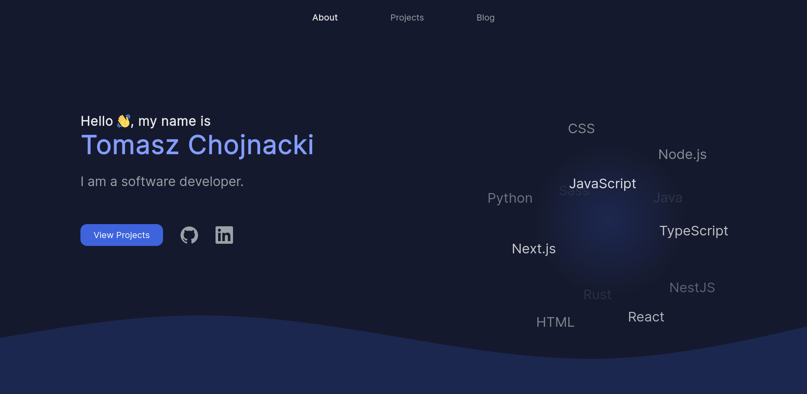

# [tchojnacki.dev](https://tchojnacki.dev) - a personal website 🧑‍💻
<div align="center">

[](https://tchojnacki.dev)
[](https://github.com/tchojnacki/tchojnacki-dev/actions)
[](https://codecov.io/gh/tchojnacki/tchojnacki-dev)
[](https://github.com/tchojnacki/tchojnacki-dev/issues)

</div>



## Technology 🔧
- Astro
- React
- Tailwind CSS
- TypeScript
- Lodash
- Vitest
- Prettier
- Git

## Deployment 🚀
### Production 🌐
The website is available online at [tchojnacki.dev](https://tchojnacki.dev), deployed through [Vercel](https://vercel.com/home).

### Development 🏗
Run the development server:
```bash
npm run dev
```
Open [http://localhost:4321](http://localhost:4321) with your browser to see the result.
