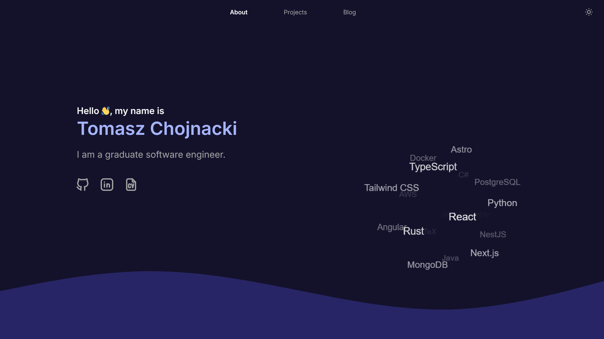

# [tchojnacki.dev](https://tchojnacki.dev) – a personal website 🧑‍💻
<div align="center">

[](https://tchojnacki.dev)
[](https://github.com/tchojnacki/tchojnacki-dev/actions)
[](https://codecov.io/gh/tchojnacki/tchojnacki-dev)
[](https://github.com/tchojnacki/tchojnacki-dev/issues)


</div>



## Technology 🔧
- Astro
- React
- Tailwind CSS
- TypeScript
- MDX
- Vitest
- Lodash
- Prettier
- Git
- GitHub Actions
- Vercel
- Figma

## Deployment 🚀
### Production 🌐
The website is available online at [tchojnacki.dev](https://tchojnacki.dev), deployed through [Vercel](https://vercel.com/home).

### Development 🏗
Run the development server:
```bash
npm run dev
```
Open [http://localhost:4321](http://localhost:4321) with your browser to see the result.

You can build the project and preview an optimized version using:
```bash
npm run build
npm run preview
```

### Testing 🧪
Enter the following command:
```bash
npm run test
```
Test results will be printed alongside a coverage report. The tests are also run as part of the CI/CD process
on every pull request. Note that only the logic is tested - there are no visual tests.
