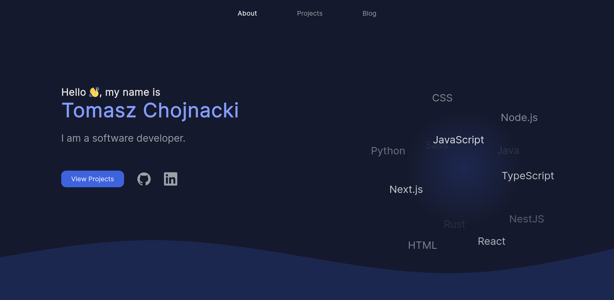

# tchojnacki.dev - a personal website 🧑‍💻
<div align="center">

[](https://tchojnacki.dev/)
[](https://github.com/tchojnacki/tchojnacki-dev/actions)
[](https://github.com/tchojnacki/tchojnacki-dev/pulls)

</div>



## Technology 🔧
- Next.js
- React
- TypeScript
- SASS
- Lodash
- Jest
- Git
- ESLint
- Prettier

## Deployment 🚀
### Production 🌐
The website is available online at [tchojnacki.dev](https://tchojnacki.dev/), deployed through [Vercel](https://vercel.com/home).

### Development 🏗
Run the development server:
```bash
npm run dev
```
Open [http://localhost:3000](http://localhost:3000) with your browser to see the result.
