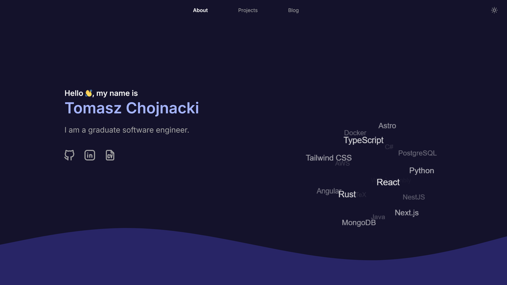
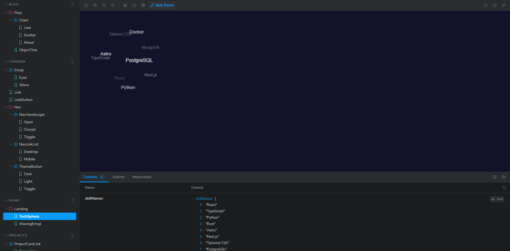

# [tchojnacki.dev](https://tchojnacki.dev) – a personal website 🧑‍💻

<p align="justify">
<strong>tchojnacki.dev</strong> is a modern personal portfolio and blog that highlights my projects, skills, and social links. It features interactive blog posts, a responsive design with multiple themes, and fast-loading pages. It receives around 50-100 unique monthly visitors (mainly from Google) through SEO-optimized and engaging content and has been maintained and actively updated since 2021. Furthermore, it achieves top-tier performance, with 100s across Google PageSpeed Insights and a 100 RES in Vercel Speed Insights. The main technologies used in the website comprise Astro, React, TypeScript, and Tailwind CSS. Additionally, a custom blog framework built on top of MDX enables the creation of interactive posts on various technical topics.
</p>

<div align="center">

[](https://tchojnacki.dev)
[](https://github.com/tchojnacki/tchojnacki-dev/actions)
[](https://codecov.io/gh/tchojnacki/tchojnacki-dev)
[](https://github.com/tchojnacki/tchojnacki-dev/issues)


</div>



## Technology 🔧

- **Core:** Astro, React, TypeScript
- **Design:** Tailwind CSS, Tabler Icons, Simple Icons, Figma
- **Blog:** MDX, KaTeX, nanostores
- **Helpers:** Lodash, clsx
- **Tools:** Vitest, Storybook, Vite, Git
- **CI/CD:** GitHub Actions, Codecov
- **Formatting:** Prettier, commitlint, Husky
- **Platforms:** Vercel, Squarespace

## Repository 🗃️

- [/.github](./.github) - GitHub Actions workflows and Codecov configuration
- [/src](./src) - project source code
  - [/assets](./src/assets) - emojis, images, and other bundled assets
  - [/components](./src/components) - reusable UI components
  - [/consts](./src/consts) - various configuration flags used across the project
  - [/content](./src/content) - Astro content definitions
    - [/posts](./src/content/posts) - blog posts written in MDX
    - [/projects](./src/content/projects) - projects from my portfolio
    - [/skills](./src/content/skills) - short technology definitions
  - [/hooks](./src/hooks) - custom, reusable React hooks
  - [/layouts](./src/layouts) - page layouts
  - [/lib](./src/lib) - domain logic and utilities
  - [/pages](./src/pages) - routes used by Astro for static site generation
- [/CONTRIBUTING.md](./CONTRIBUTING.md) - guidelines for external contributors

## Deployment 🚀

### Production 🌐

The website is available online at [tchojnacki.dev](https://tchojnacki.dev), deployed through [Vercel](https://vercel.com/home).

### Development 🏗

Run the development server:

```bash
npm run dev
```

Open [http://localhost:4321](http://localhost:4321) with your browser to see the result.

You can build the project and preview an optimized version using:

```bash
npm run build
npm run preview
```

### Testing 🧪

Enter the following command:

```bash
npm run test
```

Test results will be printed alongside a coverage report. The tests are also run as part of the CI/CD process
on every pull request. Note that only the logic is tested - there are no visual tests.

## Storybook 📚

Storybook documents the components written in React (due to [technical limitations](https://github.com/storybookjs/storybook/issues/18356), Astro components cannot be documented). To run Storybook locally, use:

```bash
npm run storybook
```


